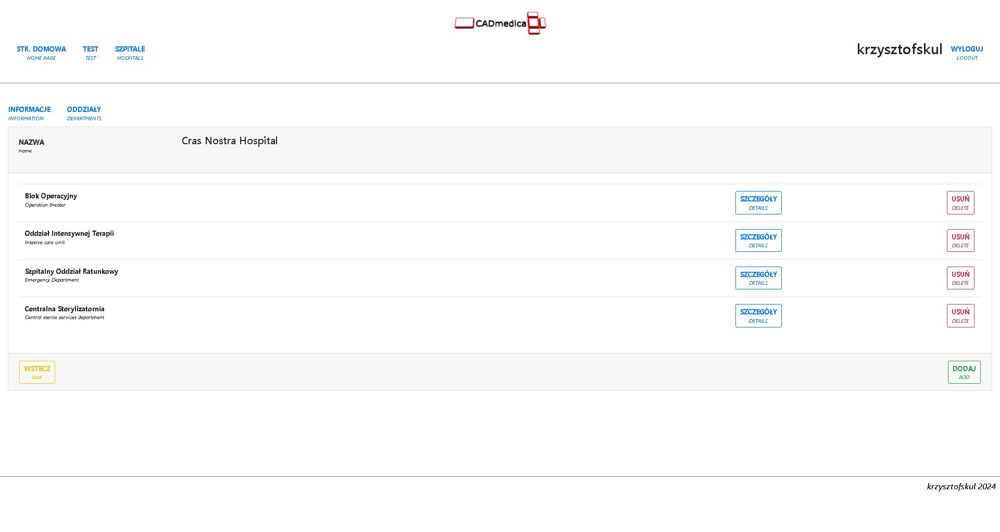

  

#### INTRODUCTION
The main goal of this application is to build hospital rooms and departments structure as well as to calculate equipment costs, service and power consumption per room and department.

#### SCREENSHOTS
**HOME PAGE**  
  
**LIST OF DEPARTMENTS PAGE**  
  

#### TECHNOLOGY
* Java/SpringBoot
* SpringSecurity  
* MySQL/Hibernate  
* Thymelyeaf/Bootstrap

#### PROJECT STATUS AND TODO'S

**Project status:** *in progress*  

**TODO:**  

* VER. 0.2-ALPHA:
    * create an actual path of hospital structure  
    * create a functionality which allows to add equipment/devices to the room:  
        * functionality at back-end  
          * device and device category package  
            * ~device demo generator~  
            * ~JUnit test~    
          * technicalData class (?)  
          * **create demo devices and add to demo rooms  (DONE)**
            * create a functionality that allows to manage devices in the room (~add~, remove, show details)  
        * functionality at front-end  
    * ~create init data essentials functionality~  
    * turn off menu while creating new hospital  
    * code cleaning  
    
#### CONTACT
*krzysztofskul@protonmail.com*