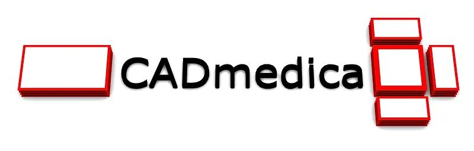

  

#### INTRODUCTION
The main goal of this application is to build hospital rooms and departments structure as well as to calculate equipment costs, service and power consumption per room and department.

#### SCREENSHOTS
**HOME PAGE**  
   

#### TECHNOLOGY
* Java/SpringBoot
* SpringSecurity  
* MySQL/Hibernate  
* Thymeleaf/Bootstrap

#### PROJECT STATUS AND TODO'S

**Project status:** *in progress*  

**TODO:**  

* VER.#0.2-BETA-FINAL | DONE  
* VER.#0.2-BETA-RC | TODO:  
    * refactor(config): aplication.properties data update to deploy  
* VER.#0.3-ALPHA-SNAPSHOT | TODO:  
    * implement(functionality): room data sheet  
      * implement(code): add dataTechnical class to the room  
      * implement(code): add dataArchitectural class to the room  
    * implement(functionality): equipment and room functional categories  
      * medical  
      * medical-consultation  
      * medical-examination/diagnostic  
      * medical-treatmend  
      * medical-operation  
      * medical-preparation  
      * sanitary  
      * technical  
      * laboratory  
      * office  
      * public  
      * staff  
      * patient  
      * support  
    * implement(functionality): error page  
    * refactor(): product/equipment/device nomenclature  
    * refactor(): create technicalData class (?)  
    * implement(functionality): activate/deactivate manufacturer (?)  
    
#### CONTACT
*krzysztofskul@protonmail.com*