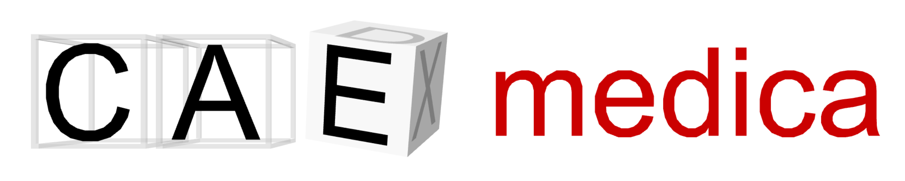
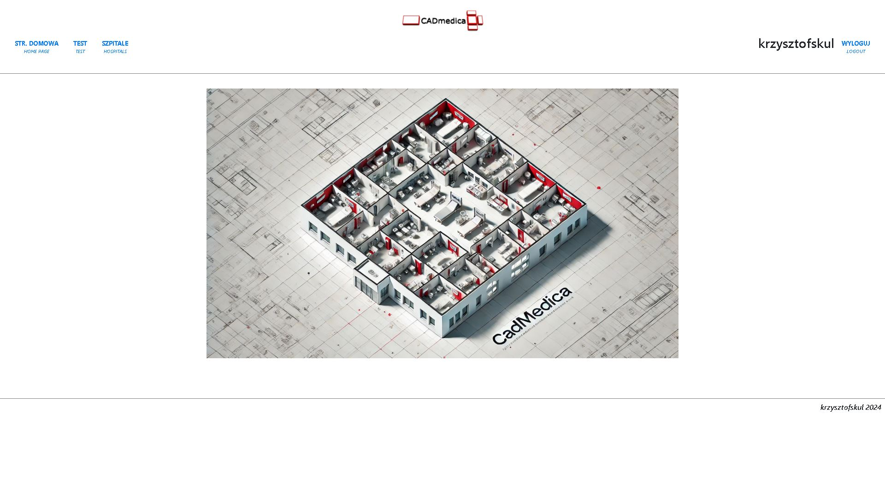

  

#### INTRODUCTION
The main goal of this application is to build hospital rooms and departments structure as well as to calculate equipment costs, service and power consumption per room and department.

#### DEMO PAGE
https://cadmedica-426c866a6bb5.herokuapp.com/login

#### SCREENSHOTS
**HOME PAGE**  
   

#### TECHNOLOGY
* Java/SpringBoot
* SpringSecurity  
* MySQL/Hibernate  
* Thymeleaf/Bootstrap
* OpenAI/chatGPT

#### PROJECT STATUS AND TODO'S

**Project status:** *in progress*  

**TODO:**  

* VER.#0.5-ALPHA:  
    * feat(currency): implement currency management DONE  
    * feat: implement auto creation of departments  
    * feat: implement investor management   
    * feat(contact): implement contact details management  
    * feat(address): implement api https://restcountries.com/   
    * feat: implement planned and resulted area and budget  
    * feat: implement room data sheet  
    * feat(ui): highlight the menu button at current page  
    * feat: show power values at the page with a list of hospitals/departments/rooms  
    * refactor: create technicalData class (?)  
    * feat: delete, activate and deactivate the manufacturer and its products (?)  
* VER.#0.6-ALPHA:  
    * feat(springsecurity-users-management): update functionality  
      * create user registration functionality  
      * update login functionality to MySQL backed user system  
    
#### CONTACT
*krzysztofskul@protonmail.com*