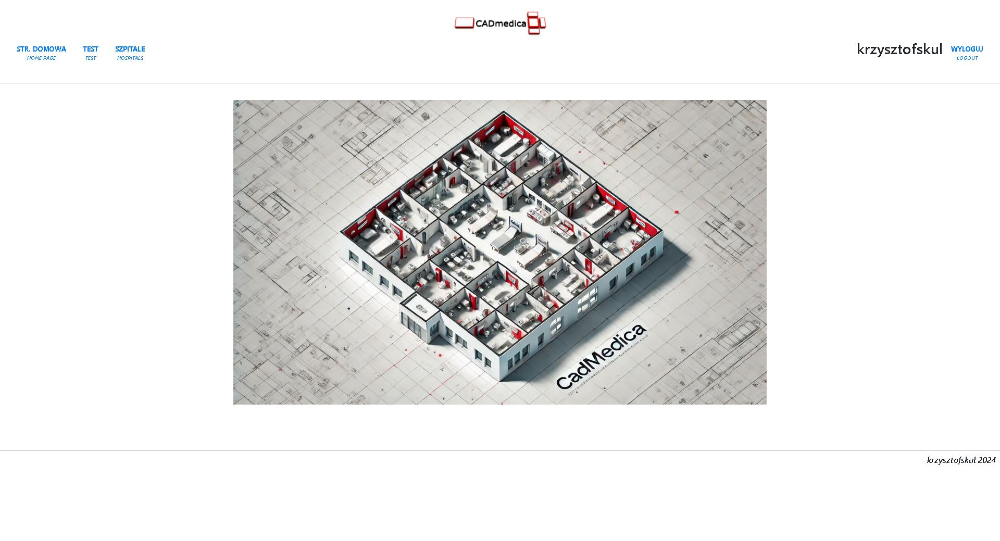

  

#### INTRODUCTION
The main goal of this application is to build hospital rooms and departments structure as well as to calculate equipment costs, service and power consumption per room and department.

#### SCREENSHOTS
**HOME PAGE**  
   

#### TECHNOLOGY
* Java/SpringBoot
* SpringSecurity  
* MySQL/Hibernate  
* Thymelyeaf/Bootstrap

#### PROJECT STATUS AND TODO'S

**Project status:** *in progress*  

**TODO:**  

* VER. 0.2-ALPHA-FINAL:  
    * code cleaning  
    * aplication.properties data update to deploy  
* VER. 0.2-BETA-SNAPSHOT:  (in progress...)
    * update: add room with address data  
    * update: add department with address data  
    * implement: room cost calculation (DONE)  
    * implement: department cost calculation (DONE)  
    * implement: hospital cost calculation  (TODO NEXT)  
    * implement: equipment management functionality  
    * implement: department and room edit  
    * update: create technicalData class (?) 
    
#### CONTACT
*krzysztofskul@protonmail.com*